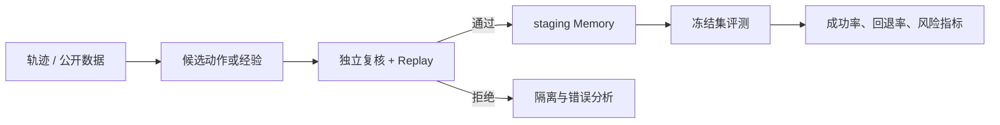
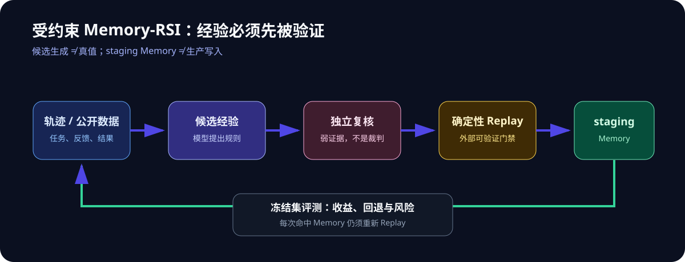

# JEV-RSI Lab

一组可复现的 Memory-RSI（recursive self-improvement）研究实验：从轨迹中生成候选经验，
再用独立复核与确定性 Replay 决定是否可在**离线评测**中使用。

> 本仓库不训练模型权重、不执行真实业务动作，也不把模型共识当作事实真值。

## 研究问题



核心问题不是“模型能否写出反思”，而是：被外部可验证信号约束的经验，是否能在未见样本
上带来收益，同时不引入回退或不安全结果。



## 已纳入的实验

| 实验 | 数据 | 目标 | 状态 |
| --- | --- | --- | --- |
| Public retail semantic routing | Bitext 公开电商客服数据集，运行时下载 | 仅测语义路由，不做业务决策 | 可复现 |
| P2-I constrained RSI | 脚本内生成的合成样本 | 验证 Replay 门控的最小闭环 | 可复现 |
| P2-G synthetic Replay | 50 条合成 complaint / exchange fixtures | 验证候选动作与确定性 Replay 的职责分离 | 已记录 |
| P3-A three-model Memory-RSI | 100 条完全合成、多语种样本 + 虚构版本化政策 | 评估 Replay-validated Memory 的冻结集收益 | 已记录 |
| Banking77 prototype memory | Banking77 公开数据，运行时下载 | 受真实标签约束的原型检索实验 | 已记录 |

P3-A 的实际结果是冻结集 direct-policy pass rate 从 **37.5%** 到 **40.0%**（+2.5pp，
纠正 1 条、没有已成功样本回退）。这只证明该受控合成环境有微弱可测收益；**不代表生产安全、
模型可自证真值或模型权重实现自进化**。详见 [报告](reports/p3a-synthetic-memory-rsi.md)。

## 数据与隐私边界

- 仓库不保存 Bitext 原始数据；脚本从上游数据集运行时下载，使用前应复核其许可证与使用条款。
- 仓库中的 P2-I 与 P3-A 样本、政策、Memory 均为合成评测材料，不含真实客户、员工或业务数据。
- 含人工标注、个人标识或内部协作记录的旧材料没有迁入本仓库。
- 任何新数据进入仓库前，必须先做来源、再分发许可、脱敏和可公开性检查。

## 结构

```text
scripts/    Kaggle 可执行实验脚本
data/       仅合成 P3-A 评测输入、虚构政策与 staging Memory
reports/    结果、口径和局限
docs/       实验协议与数据来源说明
```

## Kaggle 跑法

启用 GPU 和 Internet，上传单个 `scripts/*.py` 或把仓库作为 Dataset 挂载：

```bash
python /kaggle/input/jev-rsi-lab/scripts/laya_public_retail_benchmark.py
python /kaggle/input/jev-rsi-lab/scripts/laya_p2i_simulated_constrained_rsi.py
python /kaggle/input/jev-rsi-lab/scripts/laya_p3a_three_model_memory_rsi.py
```

P3-A 还需要把 `data/synthetic/p3a/p3a_synthetic_business_policy_v1.json` 作为 Kaggle Input
提供给脚本；脚本会同时校验政策文件的唯一性与版本。

实验文档与数据产物索引见 [reports/artifact-index.md](reports/artifact-index.md)。
