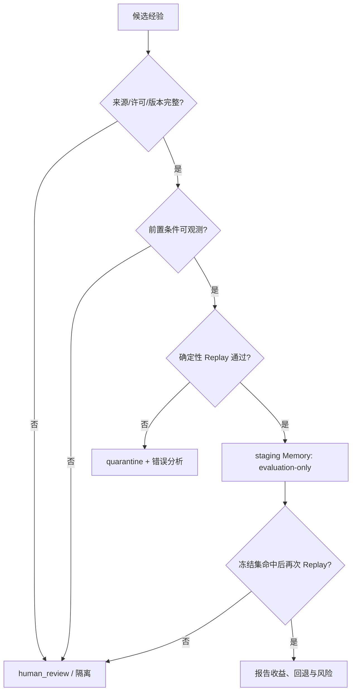

# P3-C：safe-default 策略证据模板

此模板用于把外部批准的、可公开的政策证据转换为**离线评测用**的受约束规则。它不是业务流程
文档，也不能替代审批。没有完整证据与 Replay 的条目必须落到 `human_review`。

## 最小条目

```yaml
policy_id: public-policy-example-v1
version: "1.0.0"
source:
  public_url: https://example.org/policy
  retrieved_at: "YYYY-MM-DD"
  license_or_permission: "verified"
scope:
  intent: example_intent
  required_observations:
    - field_a
    - field_b
preconditions:
  - statement: "external condition that Replay can verify"
safe_default:
  route: human_review
allowed_offline_actions:
  - propose_route_only
prohibited_actions:
  - execute_external_tool
  - update_production_memory
replay:
  fixture_id: synthetic-or-public-fixture-id
  expected_route: human_review
  deterministic_check: "assert proposed route equals expected route"
expiry:
  review_after: "YYYY-MM-DD"
```

## 准入判定



## 评测限制

- staging Memory 只能用于离线评测，不能写入生产 Memory、训练数据或模型权重。
- 策略发生版本变化、证据过期、字段缺失或 Replay 不可复现时，原条目立即失效并回退到
  `human_review`。
- 报告必须同时展示 `errors_corrected`、`successes_regressed`、不安全候选率与最终执行数；
  只报成功率是不够的。
