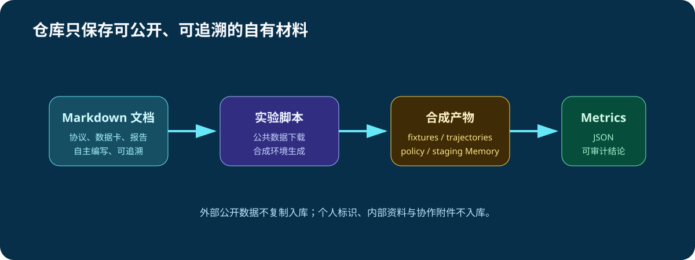

# 实验文档与产物索引

本索引只列出本仓库自主编写的 Markdown 文档、代码与可公开的实验输出；不含外部源文档、
协作附件、外部论文 PDF、人工协作台账或含个人标识的文件。



| 实验 | 自建 Markdown | 代码 | 已提交的输出数据 |
| --- | --- | --- | --- |
| RSI 架构与协议 | [protocol](../docs/experiment-protocol.md)、[pipeline](../docs/rsi-pipeline.md) | — | — |
| Banking77 原型 Memory | [report](banking77-prototype-memory.md) | 使用公开数据的运行流程在报告中记录 | 不复制上游数据集 |
| P2-G Synthetic Replay | [analysis](p2g-synthetic-replay.md) | [`laya_p2g_synthetic_replay.py`](../scripts/laya_p2g_synthetic_replay.py) | 50 fixtures、完整 replay trajectories、rejections、metrics JSON |
| P3-A 三模型 Memory-RSI | [report](p3a-synthetic-memory-rsi.md) | [`laya_p3a_three_model_memory_rsi.py`](../scripts/laya_p3a_three_model_memory_rsi.py) | 100 合成案例、虚构政策、staging Memory、corrected cases、metrics JSON |
| P3-B 私有人工审核边界审计 | [脱敏聚合报告](p3b-private-gold-boundary.md) | — | 不保存原始人工审核数据、工作簿、逐条结果或截图 |
| P3-C safe-default 政策模板 | [可公开 Markdown 模板](../docs/p3c-safe-default-policy-template.md) | — | 原创流程图；不保存工作簿或协作附件 |
| P4 公开证据与冻结集 Memory | [P4 报告](p4-public-memory-evidence.md) | 复现步骤与来源钉扎在报告中记录 | 仅脱敏聚合 metrics JSON，不复制任务、轨迹或逐题输出 |
| Public retail semantic routing | [data source](../docs/data-sources.md) | [`laya_public_retail_benchmark.py`](../scripts/laya_public_retail_benchmark.py) | 不复制上游 Bitext 数据 |
| 原创实验图 | [`assets/diagrams/`](../assets/diagrams) | — | RSI 闭环、P2-G gate、P3-A 角色边界、P3-A 结果、P3-C admission、P4 evidence 关系图 |

## 文件位置

```text
data/synthetic/p2g/    P2-G fixtures、trajectory 与 rejection JSONL
data/synthetic/p3a/    P3-A cases、虚构 policy、staging Memory 与 corrected cases
reports/*.md           我们自己的实验报告与结果解读
reports/*_metrics.json 程序可读取的聚合指标
```

## 读结果时的硬边界

- P2-G 和 P3-A 的数据、环境和政策均为合成，结果只支持机制层结论。
- 所有 Memory 都是 `evaluation-only` / staging 产物，不能被解释为生产 Memory 写入。
- 外部公开数据仅通过脚本下载；是否允许下载、缓存或再分发由其上游许可证决定。
- 本索引不包含飞书或任何协作平台文档、导出物、链接、截图；这些都不是本仓库可公开的自主产物。
