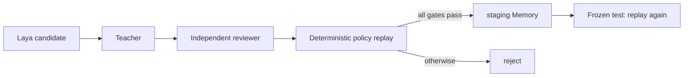

# P3-A：三模型、Policy-gated Memory-RSI（合成环境）

## 目的

验证一个最小但完整的闭环：业务候选模型生成动作，两个独立语言模型提出/复核候选，
确定性虚构政策 Replay 做最终门禁；只有通过门禁的经验才能进入 staging Memory，
并在 template-disjoint 的冻结测试集上验证。

## 实验配置

| 项目 | 值 |
| --- | --- |
| 运行环境 | Kaggle T4 × 2 |
| 业务候选 | Laya Router |
| Teacher | `HuggingFaceTB/SmolLM2-1.7B-Instruct` |
| Reviewer | `HuggingFaceTB/SmolLM2-360M-Instruct` |
| 数据 | 100 条脚本生成的多语种合成样本；60 train / 40 frozen test |
| 政策 | `JEV_SYNTHETIC_ECOM_AFTERSALES_V1`，完全虚构、版本化 |
| 数据泄漏控制 | train/test 无 case ID 重叠、无 template family 重叠 |

## 流程

## 实测结果

| 指标 | Baseline | 带 staging Memory |
| --- | ---: | ---: |
| direct-policy pass rate | 37.5% | 40.0% |
| 绝对变化 |  | +2.5pp |
| corrected errors |  | 1 |
| regressed successes |  | 0 |
| Memory hit rate |  | 7.5% |
| 最终不安全执行数 | 0 | 0 |

构建侧共有 60 条样本，最终只有 1 条进入 staging Memory。Teacher/Reviewer 的 action
accuracy 分别为 17% 和 21%，二者 exact agreement 为 13%；这解释了为什么“模型共识”
只能作为候选门，不能被当成真值。

## 能得出什么，不能得出什么

**可以得出**：在一个刻意可控、拥有确定性 oracle 的合成环境中，Replay 验证后的 Memory
出现了小幅、无回退的冻结集增益。

**不能得出**：真实业务安全、模型具有通用自进化能力、任何模型输出可以自动晋升为生产
Memory，或模型权重已经被训练改进。

完整可机器读取的指标见 [p3a_synthetic_memory_rsi_metrics.json](p3a_synthetic_memory_rsi_metrics.json)。
