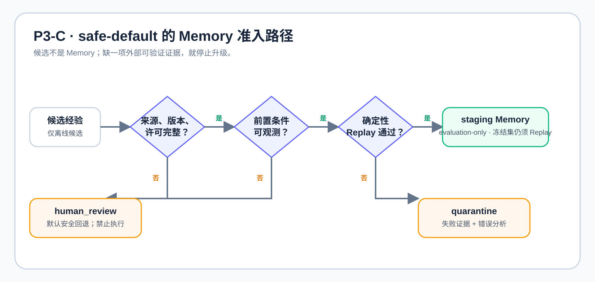

# P3-B：私有人工审核输入的 Memory-RSI 边界审计

## 为什么只发布本报告

P3-B 使用了一个小规模、人工审核的私有路由评测集。其原始样本、标签、工作簿、逐条模型
输出和截图均**不具备公开归档条件**，因此没有复制到本仓库，也没有以任何协作平台文档、链接
或导出物替代。本报告是重新撰写的脱敏聚合记录，而非数据集发布。

这是一项 `evaluation-only` 负向门控实验：验证在没有可批准的外部策略证据时，系统是否会错误
地把模型候选升级为 Memory 或业务动作。

## 设计

| 项目 | 记录 |
| --- | --- |
| 审核记录数 | 36 |
| 构建集 / 冻结集 | 24 / 12 |
| 重叠控制 | case ID 与精确消息均不重叠；语义类别可重叠 |
| 角色 | 一个待评估路由器 + 两个独立的候选/复核角色 |
| 硬约束 | 无批准外部策略；候选只能通向 `human_review`；禁止模型训练写入、Memory 写入和真实工具调用 |
| 运行资源 | 2 × Tesla T4；随机种子 `20260925` |

这里的“人工审核”只提供保守的离线路由目标，**不构成业务动作授权**。两个模型一致也不等于
事实真值；没有批准策略与可回放环境，就没有 Memory 准入资格。

## 脱敏聚合结果

| 指标 | Baseline | RSI | 解读 |
| --- | ---: | ---: | --- |
| 冻结集 safe-default 匹配率 | 8.33% | 8.33% | 没有提升 |
| Memory hit rate | — | 0.00% | 没有可准入的 Memory |
| 候选中不安全错误率 | 58.33% | 58.33% | 不能把候选视为可执行结果 |
| 纠正 / 回退 | 0 / 0 | 0 / 0 | 净纠正为 0 |
| 最终不安全执行 | 0 | 0 | 门控按预期阻断 |

构建阶段的合格案例数为 0，staging Memory 条目数也为 0；冲突拒绝、支持计数分布均为空。
这不是失败后“补救”的安全性，而是通过**不写入、不执行、转人工审核**实现的默认安全行为。

## 结论与后续门槛

- 不存在正向净纠正信号，禁止把该结果描述为模型自我改进或模型权重 RSI。
- 负结果仍有价值：它验证了“缺外部证据则不升级”的门控能阻止 Memory 与动作越权。
- 若要重启此方向，须先获得可公开、版本化且有再分发权限的策略证据与真实可回放状态；随后在
  新的、未接触的 shadow 集上报告置信区间、回退和不安全候选率。

## 未归档物清单

| 不归档对象 | 原因 |
| --- | --- |
| 原始人工审核样本与标签 | 私有数据，不公开再分发 |
| 工作簿与逐条输出 | 可能包含协作或个人识别元数据 |
| 截图、协作平台文档及其链接 | 不是本仓库的可公开自主产物 |
| 真实业务策略、工具调用或状态 | 不在本研究仓库授权范围内 |
