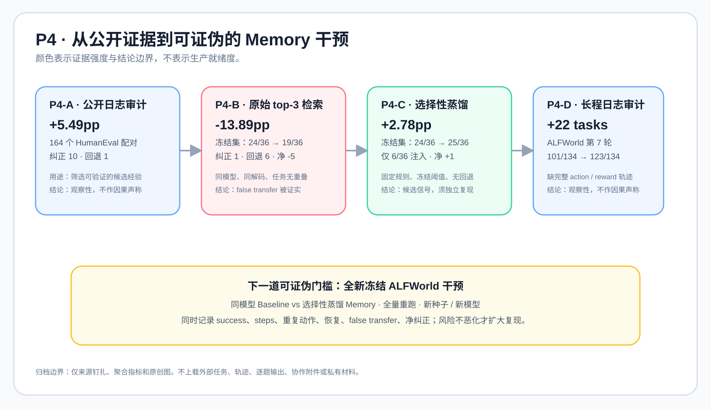

# P4：公开反思证据、冻结集迁移与长程审计

## 结论先行

P4 不支持“Memory 已可生产使用”的结论。它给出了三类不同强度的证据：

1. **P4-A / P4-D** 是固定版本公开日志的观察性审计，能用于发现候选模式与冻结后续设计，不能
   证明 JEV 的因果效果。
2. **P4-B** 是同模型、同解码、无任务重叠的冻结 HumanEval 干预：原始 top-3 Memory 使通过率
   从 66.67% 降到 52.78%，出现 6 个回退、仅 1 个纠正。这是重要的反例：相似检索会发生 false
   transfer。
3. **P4-C** 以固定的任务无关规则和阈值选择性注入，在同一冻结集得到 69.44%（相对基线
   +2.78pp，净纠正 +1，无回退）。但它复用了 P4-B baseline，且只有 36 个任务；因此是
   **候选信号**，需要在新种子、新模型和全量独立重跑中验证。



## 来源与共同边界

所有 P4 公开材料均来自 [Reflexion](https://github.com/noahshinn/reflexion) 的固定提交
`218cf0ef1df84b05ce379dd4a8e47f17766733a0`（MIT）。本仓库不复制其任务、逐题输出、完整轨迹、
对话或源代码；仅记录自主撰写的报告、聚合指标与原创图。外部材料在复现时按许可证从上游获取。

P4-B/C 运行环境：`Qwen/Qwen2.5-Coder-3B-Instruct`、Tesla T4、CUDA 12.8、
Transformers 4.48.3、随机种子 `20260927`。这些环境信息用于可比性，不代表通用吞吐或模型
能力结论。

## P4-A：公开 Reflexion 日志审计

| HumanEval 配对日志 | 数值 |
| --- | ---: |
| 任务数 | 164 |
| 基线成功 | 141 / 164（85.98%） |
| Reflexion 成功 | 150 / 164（91.46%） |
| 配对差 | +5.49pp；bootstrap 95% CI [1.83pp, 9.76pp] |
| 纠正 / 回退 | 10 / 1 |
| 可作为 Memory 构建候选的证据 | 5 |
| 因为证据不充分而冻结 | 2 |
| 无效反思而隔离 | 13 |

WebShop 的公开累计摘要到第 4 轮从 34% 到 35%（+1pp），但缺完整动作日志，不能给出干净的
因果估计。P4-A 的产出是“选择何种干预”的证据筛选，而非干预本身。

## P4-B：原始检索的冻结集反例

| 指标 | Baseline | 原始 top-3 Memory |
| --- | ---: | ---: |
| 冻结任务 | 36 | 36 |
| 通过 | 24（66.67%） | 19（52.78%） |
| 平均生成延迟 | 2.84 s | 3.87 s |
| 输入 / 输出 token | 7,233 / 2,376 | 49,093 / 2,748 |
| 纠正 / 回退 | — | 1 / 6 |
| 净纠正 | — | -5 |

任务按照确定性规则分成 5 个构建任务和 36 个冻结任务，任务 ID 无重叠；两臂使用相同模型和
解码设置，顺序做 counterbalance，单元测试在资源受限子进程内执行。负结果说明：更多检索上下文
既增加延迟和上下文消耗，也可能把不适用经验迁移到新任务。

## P4-C：选择性蒸馏的候选信号

P4-C 在 P4-B 的公开证据基础上，把 5 条经验蒸馏成固定、可读、任务无关的规则；`top_k=1`，相似
度阈值为 `0.08`，阈值在运行前冻结。36 个任务中仅 6 个注入规则，其余 30 个直接回退 baseline。

| 指标 | Baseline（复用 P4-B） | P4-C selective distilled Memory |
| --- | ---: | ---: |
| 通过 | 24 / 36（66.67%） | 25 / 36（69.44%） |
| 纠正 / 回退 | — | 1 / 0 |
| 净纠正 | — | +1 |
| 规则注入任务 | — | 6 / 36 |
| 注入任务平均生成延迟 | — | 3.88 s |

P4-C 没有授权生产使用，因为它不是完全独立的实验：baseline 输出被复用，蒸馏规则仍有人工措辞，
而且 HumanEval 并非长程具身环境。下一步应同时重跑两臂，并改变种子、模型和冻结集。

## P4-D：ALFWorld 公开长程日志审计

该审计覆盖 134 个公开环境。第 7 轮时，baseline 101 / 134，Reflexion 123 / 134；配对统计为
Reflexion 独有成功 23、baseline 独有成功 1、共同成功 100、共同失败 10，净增 22 个环境，
McNemar exact p = `2.98e-6`。Reflexion 最终第 15 轮达到 134 / 134。

这依然是观察性关系：公开文件没有完整的逐步动作、奖励与恢复轨迹，且历史运行并非相同模型的
新干预。审计只能把 40 个候选归为 build staging、10 个冻结为 holdout；真正的下一门槛是：

```text
冻结 ALFWorld 环境
  → 同模型 Baseline vs 选择性蒸馏 Memory
  → 完整记录 success / steps / repeated-actions / recovery / false-transfer
  → 仅在净纠正为正且风险不恶化时，扩大复现
```

## 可复现命令轮廓

在已核验许可证的隔离环境中，检出固定的公开来源，再运行本仓库的等价实验实现。不要将上游
任务或输出复制回本仓库：

```bash
git clone https://github.com/noahshinn/reflexion.git reflexion
git -C reflexion checkout 218cf0ef1df84b05ce379dd4a8e47f17766733a0
# 之后在临时目录执行审计/评测脚本，并仅导出聚合 metrics。
```

完整的脱敏数值见 [聚合 metrics](p4_public_memory_evidence_metrics.json)。
