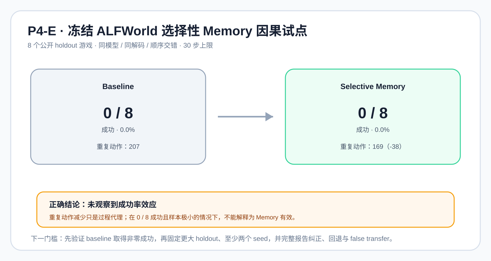

# P4-E：冻结 ALFWorld 的选择性 Memory 因果试点

## 结论先行

这是一项**未得到正向成功率信号**的冻结干预试点。8 个冻结 ALFWorld 游戏中，baseline 与
选择性蒸馏 Memory 均为 `0 / 8` 成功；净纠正为 0，不能声称 Memory 有效。

Memory 臂的重复动作数从 207 降到 169（少 38 次），但成功率没有变化，且样本只有 8 个游戏。
它最多是一个待复查的过程代理信号，不能代替任务成功、因果收益或生产准入。

## 设计

| 项目 | 固定值 |
| --- | --- |
| 环境 | [ALFWorld](https://github.com/alfworld/alfworld) `0.4.2`，MIT；公开 `valid_unseen` 游戏 |
| Memory 证据 | 固定提交的 [Reflexion](https://github.com/noahshinn/reflexion) `218cf0ef1df84b05ce379dd4a8e47f17766733a0`，MIT |
| Actor | `Qwen/Qwen2.5-Coder-3B-Instruct`，Tesla T4，FP16，seed `20260927` |
| 冻结集 | 8 个由稳定 hash 选出的 holdout 游戏 |
| 对照 | 同模型、同解码、相同最大 30 步；每游戏 baseline / selective-Memory 顺序交错 |
| 动作 | 仅从环境给出的 admissible commands 中选一个索引 |
| Memory | 基于公开 build evidence 人工蒸馏的任务无关规则；只读、evaluation-only |

完整逐步轨迹曾在本次临时运行中保存，用来计算 success、steps、重复动作和解析回退；它们含有
上游环境的任务内容和动作序列，**不进入本仓库**。本仓库只归档这份自主撰写的报告、聚合指标、
脚本和原创图。

## 聚合结果

| 指标 | Baseline | Selective Memory | 差异 |
| --- | ---: | ---: | ---: |
| 成功 | 0 / 8 | 0 / 8 | 0 |
| 成功率 | 0.0% | 0.0% | 0.0pp |
| 纠正 / 回退 | — | 0 / 0 | 净纠正 0 |
| 总重复动作 | 207 | 169 | -38 |

该轮没有任何成功样本，因此不能将较少的重复动作解释为效率提升：它可能来自更早失败、不同动作
路径或局部策略变化。正确结论是“在此配置和小型冻结集上未观察到成功率效应”。

## 严格边界与下一门槛

- 不是模型训练、权重更新或生产 Memory 写入；`training_label_authorized`、
  `memory_write_authorized` 和 `production_action_authorized` 均为 `false`。
- admissible-command 选择比开放式动作生成更容易，因此即使未来成功，也不能直接推广到一般 agent。
- 在扩大样本前，先单独验证 baseline 在一组与目标一致的公开小游戏上能取得非零成功率；否则没有
  可检验的 Memory 增益空间。
- 后续正式实验应预先固定更大 holdout、至少两个 seed，并完整报告成功、steps、重复动作、解析
  回退、纠正、回退和 false transfer。

机器可读的脱敏结果见 [P4-E aggregate metrics](p4e_frozen_alfworld_metrics.json)。
