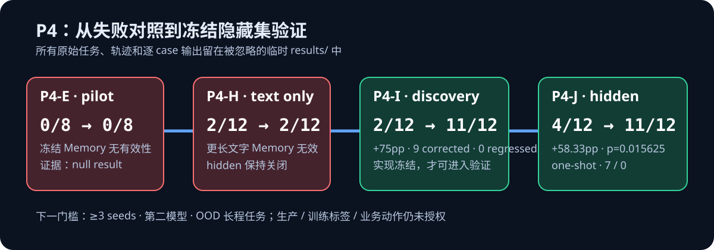
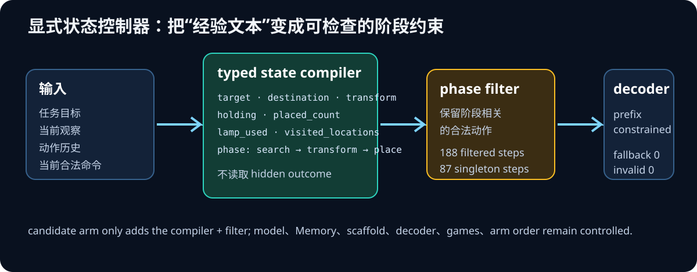

# P4-I / P4-J：显式状态控制器的冻结隐藏集验证

## 结论

在这一次公开 ALFWorld 的受控配对评测中，显式 JEV 任务状态控制器在冻结的 hidden split 上将
成功数从 **4/12（33.33%）提升到 11/12（91.67%）**：净 **+58.33pp**，7 个失败被纠正、0 个
已成功游戏回退，双侧精确 McNemar 检验为 **p = 0.015625**。

这是一条有价值的离线环境证据：相对于仅提供冻结文字 Memory，**把目标和进度编译为显式状态，
再按任务阶段过滤当前合法动作**，在本次固定模型、固定 prompt、固定解码器和固定游戏的比较中
带来了明显收益。它不等于模型权重训练、自主改写生产 Memory、可泛化到其他模型/环境，或可以执行
真实业务动作。

## 比较对象与控制变量

| 维度 | old arm | candidate arm |
| --- | --- | --- |
| 策略 | 冻结 text Memory + constrained Qwen policy | 完全相同，再加入 typed state compiler + phase-aware legal-action filter |
| 模型 / Memory / scaffold | 相同 | 相同 |
| 命令解码 | 当前合法命令的 prefix-constrained trie | 相同 |
| 游戏与执行顺序 | 同一分层游戏，双臂顺序 counterbalance | 相同 |
| 新增信息 | 无 | 仅由当前目标、当前观察和动作历史更新的状态字段 |

控制器字段为 target_type、destination_type、required_transform、required_count、holding、
transformed_current、lamp_used、placed_count、visited_locations、phase。没有把隐藏集的对象 ID、
轨迹或 outcome 写入控制器。

## 结果

| 阶段 | 旧 text Memory | 状态控制器 | 增益 | 纠正 / 回退 | 双侧精确 McNemar |
| --- | ---: | ---: | ---: | ---: | ---: |
| P4-I discovery（12） | 2/12 | 11/12 | +75.00pp | 9 / 0 | 0.00390625 |
| P4-J 冻结 hidden（12） | 4/12 | 11/12 | +58.33pp | 7 / 0 | 0.015625 |

P4-J 的接口检查也通过：423 个动态 manipulation step，parser fallback 为 0，约束解码违规为 0；
控制器在 188 个 step 过滤了候选动作，其中 87 个成为单一候选。完整的、可公开聚合数字在
[metrics JSON](p4ij_state_controller_metrics.json)；原始任务、逐 case 输出、完整轨迹和 Memory
文本不入库。

## 证据链与反例

P4-E 的最初 8-game pilot 是 0/8 对 0/8，只产生了“重复动作较少”而没有成功率证据。P4-H 随后
只把候选 Memory 写得更长，在 discovery 上仍是 2/12 对 2/12，净收益为 0；因此没有打开 hidden
split。P4-I 转而只增加显式状态和相位过滤，在 discovery 达到预设门槛，随后冻结实现，再由 P4-J
一次性打开预注册的 hidden split。

因此当前可支持的归因是“**在这次对照里，结构化状态与阶段约束优于文字经验本身**”，不是
“任何更长的 Memory 都能自我进化”。

## 可复现与限制

使用 [P4 复现说明](../docs/p4-reproduction.md) 和 scripts/p4f3 至 scripts/p4j 可重建运行链。
每次运行会把 raw task、prompt、trajectory、case-level result 写入被忽略的 results/；这些文件和
压缩包不得提交。

P4-J 的 hidden split 是一次性验证边界。复跑同一 split 不再构成独立确认；新的确认实验需要：

1. 至少 3 个独立 seed 的受控复制；
2. 第二个公开模型；
3. 一个 out-of-distribution 的长程环境；
4. 预先固定门槛、脚本哈希和报告口径。

在上述门槛前，production Memory、训练标签、业务动作三项授权均为 false。
