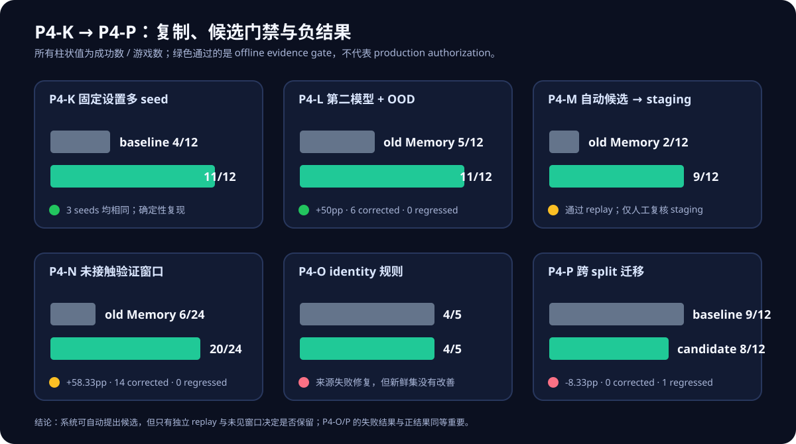

# P4-K 至 P4-P：复制、自动候选与失败控制

本文依据可执行脚本与机器可读聚合报告重新撰写；它不是协作平台文档的导出。为避免再分发上游公开环境的任务文本、逐步轨迹和逐题模型输出，仓库只保存脚本、来源钉扎信息、聚合指标和原创图。

## 研究问题与共同边界

P4-I/J 的 typed state controller 在一组 Qwen hidden split 上显示正向结果后，P4-K 至 P4-P 依次检验：固定设置的多 seed 可重复性、第二模型和互斥 OOD 集迁移、自动 failure-to-rule-to-Replay staging 流程，以及针对失败模式的新规则是否能跨 split 泛化。

所有实验都保持 offline evaluation：不训练或更新模型权重，不写入生产 Memory，不产生训练标签，也不执行真实业务动作。通过的候选至多进入受限的人工复核 staging 队列。

## 结果总览

| 阶段 | 设计 | 对照 → 候选 | 纠正 / 回退 | 结论 |
| --- | --- | ---: | ---: | --- |
| P4-K | 固定 Qwen hidden split，3 个固定贪心 seed | 4/12 → 11/12（每个 seed） | 21 / 0（跨 seed 汇总） | 轨迹完全一致；支持固定设置下的确定性复现，不证明随机鲁棒性 |
| P4-L | Mistral-7B、12 个与先前 32 个 ID 互斥的 `valid_unseen` 游戏 | 5/12 → 11/12 | 6 / 0 | +50pp，配对精确 McNemar `p=0.03125` |
| P4-M | 从 P4-L 失败证据自动生成 6 条候选状态规则；独立 replay | 2/12 → 9/12 | 7 / 0 | +58.33pp，`p=0.015625`；仅允许进入人工复核 staging |
| P4-N | P4-M 候选保持冻结；24 个零重叠验证游戏 | 6/24 → 20/24 | 14 / 0 | +58.33pp，`p=0.0001220703125`；staging 延展验证通过 |
| P4-O | 对多对象任务加入 object identity / 去重记账规则 | 新鲜零重叠集 4/5 → 4/5 | 0 / 0 | 仅修复来源失败，未在新集提升；拒绝或修改 |
| P4-P | 冻结 P4-O 规则迁移到 `valid_seen`，12 个多对象任务 | 9/12 → 8/12 | 0 / 1 | -8.33pp；跨 split 复制失败，拒绝 |

完整聚合指标见 [`p4klmnop_aggregate_metrics.json`](p4klmnop_aggregate_metrics.json)。

## P4-K：多 seed 的正确解释

P4-K 在相同 hidden 游戏、模型、controller、prompt、decoder 与阈值下重跑三个固定 seed。三个运行均为 4/12 → 11/12，7 纠正、0 回退，且 prediction hash 相同。

这排除了该固定贪心执行条件下的“偶然 seed 路径”解释；但轨迹相同也意味着它**不是**随机扰动下的方差估计，不能把它表述为一般意义的 stochastic robustness。

## P4-L：第二模型与 OOD 迁移

P4-L 固定 controller 与协议，替换为钉扎 revision 的 Mistral-7B，并在与既有 32 个游戏 ID 零重叠的公开 `valid_unseen` 集评估。旧文字 Memory 为 5/12，controller 为 11/12，净纠正 6、无回退；parser fallback 与 constrained-decoder violation 均为 0。

因此，证据可支持“在这个第二公开模型和这个互斥公开集合中出现了正向迁移”。它仍不能外推为真实业务、任意模型或无限任务分布的结论。

## P4-M/N：自动候选，但不自动批准

P4-M 将 P4-L 的失败证据编译为一个版本化候选，经过独立 replay 与预先声明的回退/接口门禁后，才允许排入 staging。来源失败 replay 从 0/7 到 6/7；新的 12 游戏冻结 replay 从 2/12 到 9/12，7 纠正、0 回退。

P4-N 不改动 P4-M 的六条规则，在第二个 24 游戏、零重叠窗口验证。结果从 6/24 到 20/24，14 纠正、0 回退，且所有接口安全计数为 0。两轮通过只意味着候选可保留给合格人工复核；报告中所有 production、training-label 与 business-action 授权仍为 `false`。

## P4-O/P：一个必须保留的负结果

P4-O 针对多对象任务的失败，加入“唯一 identity 集、禁止重复取用、按数量完成阶段”的单一规则变更。它在 3 个来源失败上从 0/3 到 3/3，但在 5 个新鲜零重叠游戏上是 4/5 对 4/5，未达到提升门槛，因此没有进入 staging。

P4-P 将未改动的 P4-O 规则迁移到新的 `valid_seen` split：基线 9/12、候选 8/12，出现 1 个回退。尽管候选在共同成功样本中平均步数较少，该效率信号不能抵消成功率回退；跨 split effect gate 失败，候选被拒绝。

这两个阶段的重要性在于：来源失败上的修复不能取代新窗口或跨 split 的验证；自动候选循环必须能够产生并明确拒绝失败候选。

## 可复现入口

| 阶段 | 脚本 |
| --- | --- |
| P4-K | [`p4k_multiseed_replication_alfworld_7b.py`](../scripts/p4k_multiseed_replication_alfworld_7b.py) |
| P4-L | [`p4l_second_model_disjoint_ood_alfworld_mistral7b.py`](../scripts/p4l_second_model_disjoint_ood_alfworld_mistral7b.py) |
| P4-M | [`p4m_automated_failure_rule_replay_staging.py`](../scripts/p4m_automated_failure_rule_replay_staging.py) |
| P4-N | [`p4n_untouched_validation_window.py`](../scripts/p4n_untouched_validation_window.py) |
| P4-O | [`p4o_unique_object_accounting.py`](../scripts/p4o_unique_object_accounting.py) |
| P4-P | [`p4p_cross_split_transfer.py`](../scripts/p4p_cross_split_transfer.py) |

脚本会在 Kaggle working 目录产生原始运行产物。原始公开任务、prompt、逐步轨迹、逐 case 输出和 zip 不进入本仓库；数据来源及再分发边界见 [`docs/data-sources.md`](../docs/data-sources.md)。
