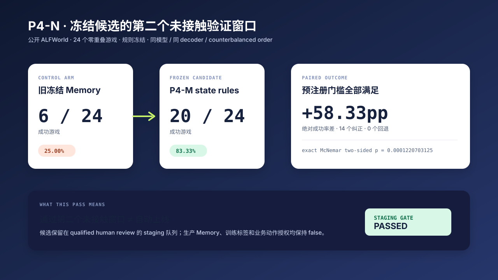

# P4-N：冻结候选的第二个未接触验证窗口

P4-N 检验的不是“能否再写出一套更好的规则”，而是一个更严格的问题：P4-M 中已冻结的六条状态规则，在不改动一行候选逻辑的前提下，能否在第二个、与此前游戏 ID 零重叠的公开 ALFWorld 窗口继续成立。

## 结论先行

候选在 24 个新游戏中从旧 Memory 的 **6/24** 到 **20/24**；出现 **14 个纠正、0 个回退**，绝对成功率差为 **+58.33pp**，配对精确 McNemar 双侧检验为 `p = 0.0001220703125`。

这只支持一个窄结论：同一个冻结候选在这个公开、固定模型和固定执行协议下，通过了第二个未接触窗口。它仍然**没有**获得生产 Memory 写入、训练标签或业务动作授权；下一状态仍是“等待合格人工复核的 staging 候选”。

机器可读的脱敏聚合结果见 [P4-N metrics](p4n_untouched_validation_metrics.json)，可执行入口见 [`p4n_untouched_validation_window.py`](../scripts/p4n_untouched_validation_window.py)。

## 设计：什么被固定，什么被比较

| 项 | 做法 |
| --- | --- |
| 候选 | 完全复用 P4-M 的 `jev-p4m-state-rules-v1`，共 6 条规则；P4-M 后没有改规则。 |
| 数据窗口 | 6 类任务各抽 4 个游戏，共 24 个；与既往记录的游戏 ID 重叠数为 0。 |
| 对照 | 旧的冻结文字 Memory。 |
| 候选臂 | 精确冻结的 P4-M state rules。 |
| 控制变量 | 模型、scaffold、decoder、游戏集合相同；arm 顺序做 counterbalance。 |
| 预注册门槛 | 成功率绝对差至少 `0.25`、回退为 0、parse fallback 为 0、decoder 违规为 0。 |

因此，臂间唯一有意差别是 Memory 表示：旧文字 Memory 对精确冻结的状态规则。这个设计不能把“模型换了”“任务混进旧样本”“参数变了”误写成规则收益。

## 结果：收益在哪里，边界在哪里

| 公开 ALFWorld 任务类 | 游戏数 | 旧 Memory | 冻结候选 | 纠正 / 回退 |
| --- | ---: | ---: | ---: | ---: |
| `pick_and_place_simple` | 4 | 1 | 4 | 3 / 0 |
| `look_at_obj_in_light` | 4 | 3 | 3 | 0 / 0 |
| `pick_clean_then_place_in_recep` | 4 | 1 | 4 | 3 / 0 |
| `pick_cool_then_place_in_recep` | 4 | 0 | 4 | 4 / 0 |
| `pick_heat_then_place_in_recep` | 4 | 1 | 4 | 3 / 0 |
| `pick_two_obj_and_place` | 4 | 0 | 1 | 1 / 0 |
| **合计** | **24** | **6** | **20** | **14 / 0** |

“灯光”任务没有提升也没有退化。这是有价值的边界证据：我们不把所有任务类型都叙述成增益，只主张在这个窗口中未观察到其退化。双物体任务为 1/4，也明确提示候选仍有明显能力边界。

## 接口安全与授权边界

除了成功率，P4-N 记录执行接口是否失真：1,034 个动态 manipulation steps 中，`parse_fallbacks = 0`，`constrained_decoder_violations = 0`。这排除了已声明的两类接口质量失败，但不等于证明任意工具环境都安全。

下面的授权状态是结果的一部分，而不是附带免责声明：

- `qualified_human_review_required = true`
- `production_memory_authorized = false`
- `training_label_authorized = false`
- `business_action_authorized = false`

## 可复现与再分发边界

仓库保存自主编写的 runner、这份报告、原创图和聚合指标。为不再分发上游公开环境的任务文本、prompt、逐步轨迹、逐题模型输出和压缩包，原始运行产物只在执行时写入本地 `results/` / Kaggle working 目录，不进入 Git 历史。来源与许可证边界参见 [数据来源说明](../docs/data-sources.md)。
